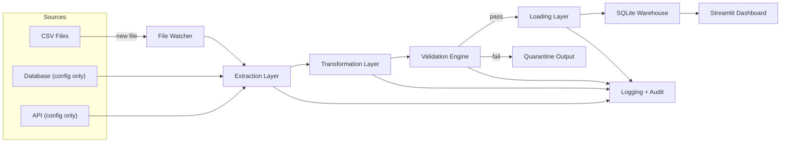
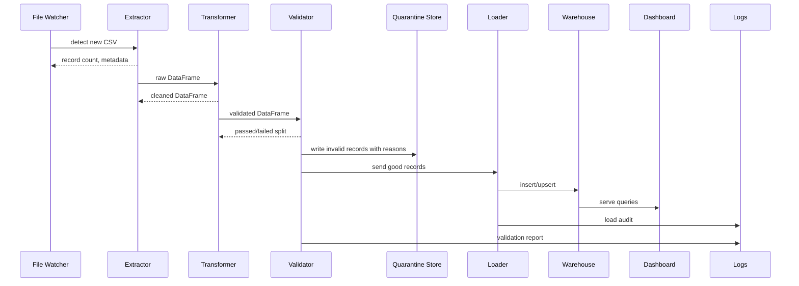

# 1. Executive Summary

This project delivers a complete, reproducible ETL system built for a bank data domain, covering extraction (CSV/DB/API), transformation/cleaning, validation/quarantine, and loading into a SQLite star-schema data warehouse. A Streamlit dashboard surfaces key analytics and data quality KPIs. The system is Dockerized, includes automated tests, and is supported by a GitHub Actions CI pipeline.

Scope:
- Modular ETL codebase (extract, transform, validate, load)
- Data warehouse (SQLite star schema) with SQL DDL script
- Data quality engine with quarantine mechanism and reporting
- Streamlit dashboard for analytics and data quality
- Docker + CI pipeline + automated unit/integration tests
- Evaluation report with record counts, quality metrics, and runtime

Intended Architecture:
- Source inputs: watched CSV folder + configurable DB/API connectors
- Extraction layer produces normalized DataFrames
- Transformation layer enforces schema, standardizes values, enriches, dedupes
- Validation engine applies rules, quarantines failures, generates report
- Loading layer populates SQLite warehouse (fact + dimensions)
- Streamlit dashboard reads from warehouse for analytics
- CI & Docker ensure reproducible builds and automated test execution

---

# 2. Requirements Analysis

## Functional Requirements

### Extraction
- Read CSV files from watched directory (`{YYMMDD}_Customer`, `{YYMMDD}_Transactions`)
- Ensure files are processed once (no reprocessing)
- Provide connectors for DB and API sources (configurable, even if not used)
- Validate delimiter and encoding
- Log record count, execution time, errors

### Transformation
- Standardize types (dates, ints, floats)
- Handle missing values (drop/impute/flag)
- De-duplicate based on business keys
- Standardize codes/units/categories
- Enrich data (derived fields like total_amount)

### Validation
- Schema validation (expected columns/types)
- Completeness checks for critical fields
- Uniqueness checks on keys
- Consistency checks (ranges, allowed lists)
- Referential integrity checks
- Quarantine invalid records with reasons
- Produce a validation report

### Loading / Warehouse
- Implement star schema (fact_transactions + dimensions)
- Load dimensions with surrogate keys
- Load fact table with FK references
- Audit source vs target record counts and load timestamps

### Dashboard
- Streamlit dashboard showing KPIs (totals, trends, top entities, data quality KPI)
- Connect to warehouse

### DevOps
- Dockerfile for pipeline
- Docker-compose if needed (e.g., PostgreSQL placeholder)
- GitHub Actions pipeline for tests/build
- Unit + integration tests

## Non-Functional Requirements

- Reproducible (same inputs yield same outputs)
- Modular and maintainable codebase
- Clear logging for auditing and debugging
- Configurable (YAML config file)
- Suitable for academic evaluation and demonstration
- Lightweight warehouse using SQLite
- Works on Windows (and cross-platform)

## Constraints, Assumptions, Risks, Dependencies

### Constraints
- Warehouse must be SQLite
- Primary extraction from CSV; DB/API connectors are configuration-only
- Must support directory watch and prevent reprocessing

### Assumptions
- Input CSVs are roughly clean but may have encoding/delimiter issues
- Transaction dataset has 100k records, customer dataset ~600
- Date range 2020–2030
- Transaction types limited to 15 categories
- Environment supports Python 3.10+ and Docker

### Risks
- CSV formatting inconsistencies (delimiters, quoting, encoding)
- Missing or malformed critical fields causing transformation/validation failures
- Performance when scaling beyond sample data (should be manageable with pandas/sqlite)
- Time drift between extraction and warehouse loads (should be recorded in audit)

### Missing Details / Ambiguities + Defaults

- Input field definitions for source CSVs not provided — we will define schemas based on typical bank data and requirements.
- Data sampling / generation not provided — we will include a `data/sample/` package with representative CSVs.
- Exact list of transaction types not given — assume a typical set (ATM, Transfer, Bill, Interest, etc.).
- API source details not given — implement a template connector with configurable base URL/token and pagination.

---

# 3. Proposed End-to-End Architecture

The pipeline flows as follows:
1. **File Watcher** monitors `data/incoming/` for new `{YYMMDD}_Customer` and `{YYMMDD}_Transactions` CSVs.
2. **Extraction Layer** reads CSVs (and optionally DB/API), produces Pandas DataFrames.
3. **Transformation Layer** applies standardization, cleansing, deduplication, and enrichment.
4. **Validation Engine** evaluates records through schema/completeness/uniqueness/consistency rules; failing records move to quarantine.
5. **Loading Layer** loads validated records into SQLite data warehouse using star schema (dimensions first, then fact).
6. **Audit & Logging** captures counts, runtime, and issues.
7. **Dashboard** reads from warehouse and displays KPIs and data quality metrics.

### Components
- **config/**: YAML config
- **extraction/**: connectors for CSV/DB/API
- **transformation/**: reusable cleaning/transformation functions
- **validation/**: rule engine and quarantine
- **loading/**: warehouse loader (dimensions + fact)
- **warehouse/**: SQL scripts + schema definitions
- **dashboard/**: Streamlit app
- **tests/**: unit + integration tests
- **data/**: sample data + staging
- **logs/**: pipeline logs
- **reports/**: evaluation output (markdown, CSV)
- **quarantine/**: invalid record dumps

## 3.1 Mermaid System Architecture Diagram



## 3.2 Mermaid ETL Workflow Diagram



---

# 4. Recommended Project Structure

```
BANK_ETL_Pipeline/
├── README.md
├── .gitignore
├── requirements.txt
├── config/
│   └── config.yaml
├── extraction/
│   ├── csv_extractor.py
│   ├── db_extractor.py
│   └── api_extractor.py
├── transformation/
│   ├── cleaning.py
│   ├── dedupe.py
│   └── enrichment.py
├── validation/
│   ├── engine.py
│   ├── rules.py
│   └── report.py
├── loading/
│   ├── loader.py
│   └── audit.py
├── warehouse/
│   ├── create_tables.sql
│   └── schema.py
├── dashboard/
│   └── app.py
├── data/
│   ├── incoming/
│   │   ├── 240101_Customer.csv
│   │   └── 240101_Transactions.csv
│   ├── processed/
│   └── sample/
├── logs/
│   └── pipeline.log
├── quarantine/
│   ├── customer_quarantine.csv
│   └── transactions_quarantine.csv
├── reports/
│   └── evaluation.md
└── tests/
    ├── unit/
    └── integration/
```

### Folder Purpose
- `config/`: YAML configuration for sources, warehouse, and policies.
- `extraction/`: Connectors and extraction logic for each source type.
- `transformation/`: Data cleaning, standardization, and enrichment functions.
- `validation/`: Rule engine and reporting for data quality.
- `loading/`: Warehouse loader and audit logging.
- `warehouse/`: SQL schema and warehouse definitions.
- `dashboard/`: Streamlit application code.
- `data/`: Raw input, processed output, and sample data.
- `logs/`: Execution logs and audit trails.
- `quarantine/`: Records that failed validation.
- `reports/`: Evaluation report and supporting artifacts.
- `tests/`: Unit and integration tests.

---

# 5. Configuration Design

## Config Needs
- Source definitions (CSV directory, DB connection, API endpoint)
- Watch settings (data directory, file patterns)
- Processed file tracking (state store / metadata)
- Cleaning policies (null handling, duplicates)
- Validation rules (schema, completeness, ranges)
- Warehouse settings (SQLite file path, connection)
- Logging settings (log level, log file path)
- Dashboard settings (port, refresh interval)

## Example `config/config.yaml`

```yaml
version: 1
watcher:
  data_dir: "./data/incoming"
  processed_dir: "./data/processed"
  file_patterns:
    customer: "^\\d{6}_Customer\\.csv$"
    transaction: "^\\d{6}_Transactions\\.csv$"
  polling_interval_seconds: 10

sources:
  csv:
    enabled: true
    encoding: "utf-8"
    delimiter: ","
    quotechar: '"'
    date_format: "%Y-%m-%d"

  database:
    enabled: false
    type: "postgres"
    host: "localhost"
    port: 5432
    database: "bank"
    user: "user"
    password: "pass"
    query: "SELECT * FROM source_table"

  api:
    enabled: false
    base_url: "https://api.example.com/v1/transactions"
    auth:
      type: "bearer"
      token: "YOUR_TOKEN_HERE"
    pagination:
      type: "page"
      page_param: "page"
      page_size_param: "per_page"
      start_page: 1
      page_size: 100

cleaning:
  null_policy:
    critical: "drop"
    non_critical: "flag"
  duplicates:
    strategy: "keep_first"
    key_fields:
      customer: ["customer_id"]
      transaction: ["transaction_id"]
  field_normalization:
    income: "float"

validation:
  schema:
    customer:
      columns:
        - name: customer_id
          dtype: "string"
          required: true
        - name: age
          dtype: "integer"
          required: true
        - name: sex
          dtype: "string"
          required: true
        - name: region
          dtype: "string"
          required: true
        - name: income
          dtype: "float"
          required: false
        - name: married
          dtype: "boolean"
        - name: children
          dtype: "integer"
        - name: car
          dtype: "boolean"
        - name: save_act
          dtype: "float"
        - name: current_act
          dtype: "float"
        - name: mortgage
          dtype: "boolean"
        - name: pep
          dtype: "boolean"
    transaction:
      columns:
        - name: transaction_id
          dtype: "string"
          required: true
        - name: customer_id
          dtype: "string"
          required: true
        - name: date
          dtype: "date"
          required: true
        - name: transaction_type
          dtype: "string"
          required: true
        - name: amount
          dtype: "float"
          required: true
        - name: balance
          dtype: "float"
          required: false
        - name: description
          dtype: "string"
          required: false
      allowed_values:
        transaction_type: ["ATM", "Transfer", "Bill", "Interest", "Deposit", "Withdrawal"]

warehouse:
  sqlite_path: "./warehouse/bank_warehouse.db"
  audit_table: "audit_load"

logging:
  level: "INFO"
  file: "./logs/pipeline.log"
  retention_days: 30

dashboard:
  port: 8501
  refresh_seconds: 60
  default_date_range_days: 30
```

---

# 6. Data Source Design

This section breaks down each source type with purpose, schema expectations, extraction logic, error handling, and logging requirements.

## 6.1 CSV Source

### Purpose
Primary source for customer and transaction data; designed to be dropped into a watching directory for automated pipeline ingestion.

### Input Format
- File names: `{YYMMDD}_Customer.csv` and `{YYMMDD}_Transactions.csv`
- UTF-8 encoded CSV (configurable)
- Delimiter: comma (configurable)
- Header row present

### Expected Schema
#### Customer CSV (example)
- `customer_id` (string)
- `age` (int)
- `sex` (string) (M/F/Other)
- `region` (string)
- `income` (float)
- `married` (bool / Y/N / 0/1)
- `children` (int)
- `car` (bool / Y/N / 0/1)
- `save_act` (float)
- `current_act` (float)
- `mortgage` (bool / Y/N / 0/1)
- `pep` (bool / Y/N / 0/1)

#### Transactions CSV (example)
- `transaction_id` (string)
- `customer_id` (string)
- `date` (YYYY-MM-DD)
- `transaction_type` (string)
- `amount` (float)
- `balance` (float)
- `description` (string)

### Extraction Logic (CSV connector)
1. Watch `data/incoming/` for new files matching patterns.
2. Validate file name against regex patterns (`{YYMMDD}_Customer.csv`, `{YYMMDD}_Transactions.csv`).
3. Confirm file not already processed (track in metadata store or `processed/` folder).
4. Attempt read via `pandas.read_csv()` with configured delimiter/encoding.
5. Validate encoding (UTF-8 by default; fallback attempts if error occurs).
6. Validate header columns match expected schema.
7. Log record count, file size, start/end time, any read errors.

### Preventing Duplicate Processing
- Maintain a `processed_files.json` or SQLite table `processed_files` tracking file name, checksum/hash, processed timestamp.
- Before processing a file, compute a hash (e.g., SHA256 of contents or path+timestamp) and check against store.
- Once processing completes successfully, mark as processed.
- If file changes after processing, either reprocess with a new hash or skip depending on policy.

### Error Cases
- Missing or extra columns: log as validation error and quarantine file.
- Encoding errors: attempt alternative encoding, else quarantine.
- Invalid delimiter: attempt autodetect; if fails, quarantine.
- Read errors (I/O): log and retry (with backoff), else fail pipeline.

### Logging Requirements
- Start/end time per file.
- Record count.
- File name, size, hash.
- Errors and warnings during read.

## 6.2 Database Source (Config-Only)

### Purpose
Enable future integration with relational data sources via connection/config.

### Configuration
- Host, port, database, credentials, driver (e.g., Postgres, MySQL, SQLite)
- Query or table selection

### Extraction Logic
- Use SQLAlchemy or `pandas.read_sql()` with provided connection string.
- Support parameterized queries.
- Optionally track last extracted timestamp for incremental extraction.

### Expected Schema
- Depends on query; schema should be defined in config for validation.

### Error Cases
- Connection failures (log and retry)
- Authentication failures
- Query errors

### Logging
- Execution time, record count, query executed, errors.

## 6.3 API Source (Config-Only)

### Purpose
Enable future integration with REST APIs for additional enrichment or external data.

### Configuration
- Base URL
- Authentication (Bearer token, API key)
- Pagination settings (page size, cursor keys)
- Rate limit guidance (requests per second)

### Extraction Logic
- Perform GET requests to the configured endpoint.
- Handle pagination (page param or cursor) until no more records.
- Handle retries with exponential backoff for transient errors.
- Respect rate limit (sleep between calls if needed).
- Convert JSON response to DataFrame.

### Expected Schema
- Defined in config; mapping of JSON fields to expected columns.

### Error Cases
- HTTP 429 (rate limit) -> backoff, retry
- HTTP 5xx -> retry with exponential backoff
- Malformed JSON -> log and quarantine

### Logging
- Request counts, response times, pages fetched, record count.

---

# 7. Data Model and Business Rules

The domain is bank customers and their transactions. The warehouse uses a star schema with a central fact table and dimensions for customers, dates, transaction types, and account profiles.

## 7.1 Source-Level Schemas

### Customer Source Schema (raw)
| Field | Type | Description |
|---|---|---|
| customer_id | string | Unique customer identifier |
| age | int | Customer age |
| sex | string | Gender code |
| region | string | Geographic region |
| income | float | Annual income |
| married | boolean | Marital status |
| children | int | Number of dependents |
| car | boolean | Car ownership |
| save_act | float | Savings account balance |
| current_act | float | Current account balance |
| mortgage | boolean | Has mortgage |
| pep | boolean | Politically exposed person flag |

### Transactions Source Schema (raw)
| Field | Type | Description |
|---|---|---|
| transaction_id | string | Unique transaction identifier |
| customer_id | string | FK to customer |
| date | date | Transaction date |
| transaction_type | string | Transaction category |
| amount | float | Amount of transaction |
| balance | float | Ending balance after transaction |
| description | string | Transaction description |

## 7.2 Business Keys

| Entity | Business Key(s) | Purpose |
|---|---|---|
| Customer | `customer_id` | Uniquely identify customer for dedupe and dimension key. |
| Transaction | `transaction_id` | Uniquely identify transaction for dedupe. |
| Transaction (alternate) | (`customer_id`, `date`, `amount`, `transaction_type`) | Used as composite key for fuzzy dedupe if transaction_id absent. |

## 7.3 Transformation Rules

| Rule | Target Field(s) | Description | Rationale | Example (Before → After) |
|---|---|---|---|---|
| Standardize date | `date` | Parse to `YYYY-MM-DD` date type | Consistent date type for warehousing and time dimension | `3/1/2024` → `2024-03-01` |
| Numeric coercion | `age`, `income`, `amount`, `balance`, `save_act`, `current_act` | Cast to int/float, strip currency symbols, handle commas | Ensures numeric aggregations work | `"1,000"` → `1000` |
| Boolean normalization | `married`, `car`, `mortgage`, `pep` | Map `Y/N`, `1/0`, `true/false` to boolean | Standard boolean representation | `"Y"` → `True` |
| Missing critical => drop | `customer_id`, `transaction_id`, `date`, `amount` | Drop rows missing required keys | Cannot load invalid critical records | `customer_id=null` → row removed |
| Missing non-critical => flag | `income`, `description`, `balance` | Keep record but set `*_missing` flag | Preserve data while tracking quality | `income=null` → `income_missing=True` |
| Deduplicate | `customer_id` (customers), `transaction_id` (transactions) | Keep first record (configurable) | Prevent duplicates in warehouse | duplicate IDs removed |
| Normalize sex category | `sex` | Map to allowed set (`M`, `F`, `O`, `U`) | Consistent categoricals | `Male` → `M` |
| Standardize region codes | `region` | Uppercase, trim, map known aliases | Consistent grouping | `north-east` → `NE` |
| Derive year/month | `transaction_date_year`, `transaction_date_month` | Extract from date for analytics | Simplifies trend analysis | `2024-03-01` → `2024`, `03` |
| Compute balance delta | `amount`, `balance_prev`, `balance` | Derive from previous balance if missing | Provide meaningful metrics | if `balance` null, compute from prior record |

---

# 8. Data Quality and Validation Engine Design

The validation engine applies rules to each record, segregating failing records into quarantine and capturing detailed reasons.

## Validation Framework

- Input: cleaned DataFrame from transformation stage.
- Output: (passed_records_df, failed_records_df)
- Approach: Evaluate each rule, collect failures per row, output a `failure_reasons` list.

### Checks

| Category | Rule | Description |
|---|---|---|
| Schema | Column presence | Ensure expected columns exist and correct types convertible. |
| Completeness | Required fields not null | E.g., `customer_id`, `transaction_id`, `date`, `amount`. |
| Uniqueness | Unique business keys | Ensure no duplicates on business keys. |
| Consistency | Range/allowed values | E.g., `age` between 18–120, `amount` not negative (unless refund). |
| Allowed values | Code lists | E.g., `transaction_type` in allowed list. |
| Referential integrity | FK exists | `customer_id` in customer dimension for transactions. |

### Quarantine Mechanism

- Records failing ANY check are written to `quarantine/<source>_quarantine.csv`.
- Each record contains original fields + `failure_reasons` (semicolon-separated) + `pipeline_run_id` + `source_file`.

### Error Reporting Format

- `failure_reasons` field: JSON array or semicolon list e.g., `[